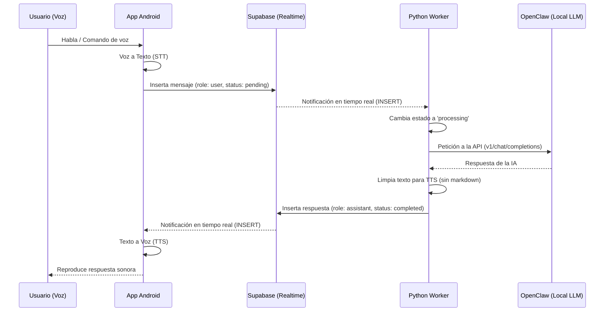

# ¿Qué es ClawVoice?

**ClawVoice** es un ecosistema de código abierto diseñado para permitir la comunicación verbal en tiempo real con modelos de Inteligencia Artificial ejecutados localmente mediante **OpenClaw**. 

El sistema está compuesto por dos piezas fundamentales que trabajan en armonía:
1. **App Android (ClawVoice)**: La interfaz móvil que captura tu voz y reproduce las respuestas.
2. **Worker Python (Claw2 Worker)**: El "cerebro" que conecta la nube (Supabase) con tu hardware local (OpenClaw).

---

## ¿Cómo funciona? (Arquitectura)

El sistema utiliza una arquitectura **basada en eventos** mediante WebSockets, eliminando la necesidad de servidores intermedios complejos o el uso de *polling* (consultas constantes).

### Características Principales
- **100% Privado y Local**: Tus conversaciones se procesan en tu propio hardware a través de OpenClaw.
- **Tiempo Real**: Gracias a Supabase Realtime, no hay latencia de espera artificial; el worker reacciona al instante.
- **Bajo Consumo Móvil**: El procesamiento pesado de la IA ocurre en tu computadora, no en tu teléfono.
- **Mono-usuario**: Diseñado como una herramienta personal de productividad.

---

## Flujo de Datos en Supabase

Toda la comunicación ocurre en una tabla llamada `oclaw2_messages`. Los estados del mensaje son:
- `pending`: El mensaje ha sido enviado desde el móvil y espera ser recogido.
- `processing`: El worker está consultando a OpenClaw.
- `completed`: La respuesta está lista y el móvil puede empezar a hablar.
- `failed`: Hubo un error en la conexión con OpenClaw.
